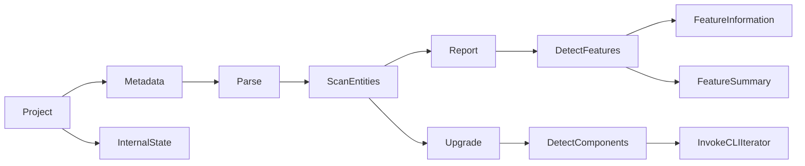

# Upgrade Plugin Architecture

The architecture for the upgrade plugin can be thought of as a directed graph from a project to an output.

The output varies based on the command issued to the plugin, the two main commands being `report` and `upgrade`.

The entity scanning functionality is implemented by adding optional callback annotations via `$tags` in a modified V2 metadata jsonschema. This is then used to traverse the projects metadata and invoke callbacks specific to reporting and upgrading.