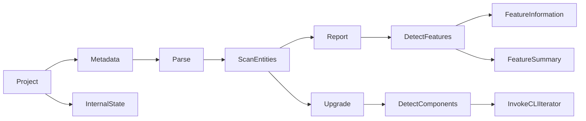

# Upgrade Plugin Architecture

The architecture for the upgrade plugin can be thought of as a directed graph from a project to an output.

The output varies based on the command issued to the plugin, the two main commands being `report` and `upgrade`.

The entity scanning functionality is implemented by adding optional callback
annotations via `$tags` in a modified V2 metadata jsonschema. This is then used
to traverse the projects metadata and invoke callbacks specific to reporting and
upgrading.

The report uses a feature tree to describe which features a user has used in
their project. This is implemented as a nested struct with annotations on each
field for if they are supported, unsupported, or partially supported. Once this
tree is computed for a project it is summarised and then the tree and the
summary are rendered in a report to stdout, or as a JSON object with just the
feature information.

Components are detected for the upgrade command that correspond to subgraph
connectors. These could be sources such as postgres, or actions, etc. Once a
component is detected the [CLI Iterator](https://github.com/hasura/v3-cli-iteration) code-generation tool is
invoked with the location and data of the component. The CLI Iterator is
designed up update an existing project and has been extended to do this with
information derived from this upgrade plugin.